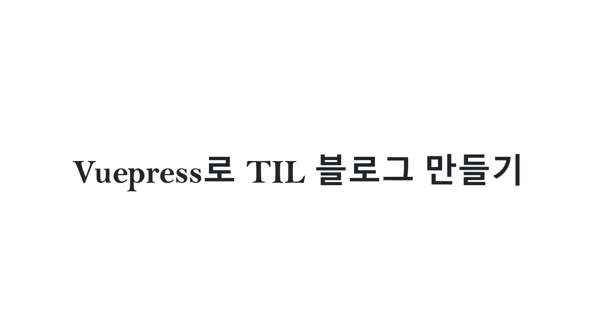

# Vuepress로 TIL 블로그 만들기

## 들어가며

### 블로그에 관하여

배운 내용을 정리하고자 시작한 블로그가 [Tistory](https://daily-mulgyeol.tistory.com/), [Velog](https://velog.io/@mulgyeol)를 거쳐 지금 이 [gatsby 블로그](https://mulgyeolog.today)에 정착하게 되었습니다.

이전 두 개의 플랫폼을 이용해보고 느꼈던 불만들을 정리해 보자면
Tistory는 마크다운 문법으로 문서를 작성하기에 적합하지 않았고,
Velog는 마크다운 문법으로 글을 작성해 포스팅 하지만, 코드 포맷이 예쁘지 않았습니다.

고민하던 중, 그럼 이번 기회에 github 블로그를 한 번 운영해 보면 좋지 않을까 싶어서 도전해보고 있습니다.

### 블로그에는 뭘 작성해야하지?

지금 블로그에는 알고리즘 기본 이론에 대한 정리와 문제를 풀었던 과정, 그리고 CS에 대해 공부하고 정리한 내용, 에세이 등을 작성하고 있습니다. 그러나 가만히 돌이켜보면 에세이나, 알고리즘 문제 해결과정을 정리한 내용을 제외하면 대부분은 다른 블로그나 자료들을 통해 공부한 내용을 적당히 편집해서 보기쉽게 정리한 내용입니다. 시작은 단순하게 `공부한 내용을 정리해보자!` 였지만, 이제는 조금 그럴싸한 `기술블로그`라는 것을 운영해보기 위해 방향성을 잡아보고자 공부한 내용을 정리하는 공간과 개발과정 그리고 생각을 정리하는 공간을 분리하려고 합니다.

이 블로그에는 주로 발생한 문제에 대한 해결과정, 개발과정에 대한 정리, 그리고 에세이 등을 작성할 예정이고, 그날그날 학습한 내용은 github TIL 레포지토리에 정리해보려고 합니다.

## vuepress로 TIL 블로그 만들기

#### reference

- [Tutorial :: Vuepress로 기술문서 빠르게 만들어보자!](https://limdongjin.github.io/vuejs/vuepress/#table-of-contents)
- [GitHub Actions로 Vuepress 배포하기](https://milooy.wordpress.com/2020/07/28/github-actions%EB%A1%9C-vuepress-%EB%B0%B0%ED%8F%AC%ED%95%98%EA%B8%B0/)
- [Github Actions에서 사용할 Token만들기](https://zeddios.tistory.com/1047)
- [[Github] 블로그에 댓글 기능 추가하기 (ft. Utterances)](https://velog.io/@outstandingboy/Github-%EB%B8%94%EB%A1%9C%EA%B7%B8%EC%97%90-%EB%8C%93%EA%B8%80-%EA%B8%B0%EB%8A%A5-%EC%B6%94%EA%B0%80%ED%95%98%EA%B8%B0-ft.-Utterances)

### 1. Vuepress Blog 만들기

멋사 운영진으로 활동하던 작년에, 다른 운영진분께서 그날 가르쳐줄 내용을 페이지를 제작해서 배포해주셨던 것이 생각나서, 그 페이지는 어떻게 만든건지 궁금해졌습니다. `Vuepress github pages`로 검색을 하다가, [**limdongjin**](https://github.com/limdongjin)님의 [Tutorial :: Vuepress로 기술문서 빠르게 만들어보자!](https://limdongjin.github.io/vuejs/vuepress/#table-of-contents) 포스팅을 보게 되었습니다. 설명이 잘되어있어 그대로 진행하면 빠르게 블로그를 만들 수 있습니다. 기능이 정상적으로 동작하지 않을 때는 limdongjin님의 TIL 레포지토리의 코드를 참고 하기도 했습니다.

#### Build Error

어느 정도 구현을 마치고, build를 했을 때, 다음과 같은 오류가 발생했습니다.

윈도우와 리눅스의 경로 구분 기호의 차이로 발생하는 문제같아 이걸 따로 수정해줄까 하다가, WSL command 창에서 실행하니 정상적으로 동작하여 WSL에서 빌드와 배포스크립트를 실행했습니다. (빌드 속도가 너무 차이나긴 합니다..)

### 2. GitHub Actions로 Vuepress 배포하기

Vuepress로 만든 다른 TIL 블로그를 찾아보다가, [Yurim님의 TIL](http://milooy.github.io/TIL)을 발견했습니다. 마침 포스팅을 할때 마다 빌드스크립트를 직접 실행시켜야 하나싶어서 불편하다고 생각하던 참에, [Yurim님의 블로그](https://milooy.wordpress.com/2020/07/28/github-actions%EB%A1%9C-vuepress-%EB%B0%B0%ED%8F%AC%ED%95%98%EA%B8%B0/)에 포스트를 푸쉬할 때마다 deploy script가 돌도록 설정하는 방법을 공유해 주신 것이 있어 도전해보게 되었습니다. 과정 중 필요한 ACCESS TOKEN 생성은 [Github Actions에서 사용할 Token만들기](https://zeddios.tistory.com/1047)를 참고했습니다.

### 3. 댓글 기능 구현하기

어느 정도 완성이 됐다고 생각하고, 여러가지 테스트를 해봤습니다. 마지막으로 댓글을 다는데, 댓글의 issue가 limdongjin님의 TIL 레포지토리에 발생해버렸습니다. 허허.. Utterances 설정은 [[Github] 블로그에 댓글 기능 추가하기 (ft. Utterances)](https://velog.io/@outstandingboy/Github-%EB%B8%94%EB%A1%9C%EA%B7%B8%EC%97%90-%EB%8C%93%EA%B8%80-%EA%B8%B0%EB%8A%A5-%EC%B6%94%EA%B0%80%ED%95%98%EA%B8%B0-ft.-Utterances)를 참고했습니다.

#### 완성

## 완성한 TIL 블로그

방법을 바꿔 새롭게 시작한 알고리즘 스터디에서 개념 정리한 내용들을 일단 포스팅 했습니다. 그동안 공부한 내용을 다 정리해 놓을지는 고민이 되지만, 앞으로 학습한 내용들은 꾸준히 정리해 두려고 합니다.
