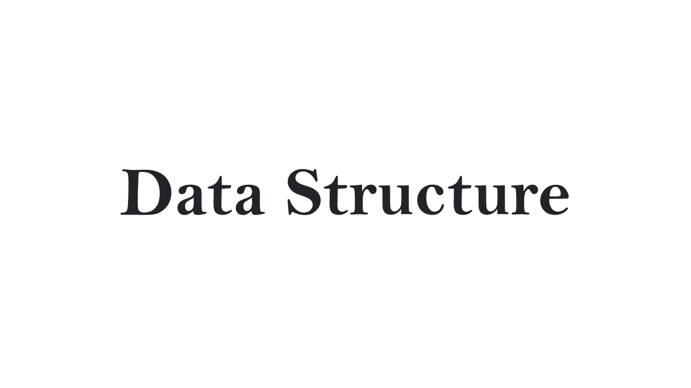

# [Data Structure] 우선순위 큐 활용하기

## 우선순위 큐(Priority Queue)

일반적인 `큐(Queue)` 자료구조는 먼저 들어간 데이터가 먼저 나오는 선입선출의 형태를 띈 자료구조이다.

반면, `우선순위 큐(Priority Queue`는 데이터에 우선순위를 부여해서 우선순위가 가장 높은 데이터부터 차례로 나오는 형태의 자료구조이다.

## Java에서의 우선순위 큐

Java에서는 라이브러리로 이미 우선순위 큐가 구현되어있고, 이를 사용하기 위해서는 `java.util.PriorityQueue` 를 import 하고

```Java
PriorityQueue<Integer> priorityQueue = new PriorityQueue<>();

```

위와 같이 선언하면 된다.

## 우선순위

Java의 PriorityQueue에서 숫자형 데이터는 기본적으로 낮은 숫자일 수록 우선순위가 높다. 다른 기준으로 우선순위를 정하고 싶거나 다른 자료형을 사용할 경우, `Comparator 클래스`나 `Comparable 인터페이스`를 사용할 수 있다.

숫자형 데이터를 다룰 때, 내림차순으로 우선순위를 매기고 싶다면, Collections.reverseOrder() 메서드를 사용할 수 있다.

```Java
PriorityQueue<Integer> priorityQueue = new PriorityQueue<>(Collections.reverseOrder());
```

## 알고리즘 문제에서 활용하기

[백준 - 2846 오르막길](https://www.acmicpc.net/problem/2846)

오르막길의 높이 중 가장 높은 오르막길을 고르는 문제이다.

오르막길의 높이들을 내림차순을 기준으로 한 PriorityQueue에 다 queue하고, 한 번만 dequeue하면 가장 높은 오르막길의 높이가 출력된다.

```Java
import java.io.BufferedReader;
import java.io.IOException;
import java.io.InputStreamReader;
import java.util.Collections;
import java.util.PriorityQueue;
import java.util.StringTokenizer;

public class Acmicpc_2846_오르막길 {

	public static void main(String[] args) throws NumberFormatException, IOException {
		PriorityQueue<Integer> PriorityQueue = new PriorityQueue<>(Collections.reverseOrder());
		BufferedReader br = new BufferedReader(new InputStreamReader(System.in));
		int N = Integer.valueOf(br.readLine());
		int[] road = new int[N];

		StringTokenizer st = new StringTokenizer(br.readLine());
		for(int i=0; i<N; i++) {
			road[i] = Integer.valueOf(st.nextToken());
		}

		int start = 0;
		int end = 1;
		int sum = 0;

		while(start < N &&end < N) {
			int height = road[end] - road[end-1];

			if(height > 0) {
				sum+=height;
				end++;
			}else {
				if(start != end-1) {
					PriorityQueue.offer(sum);
				}
				start = end;
				end = end+1;
				sum = 0;
			}
		}

		queue.offer(sum);
		System.out.println(queue.poll());
	}

}
```
