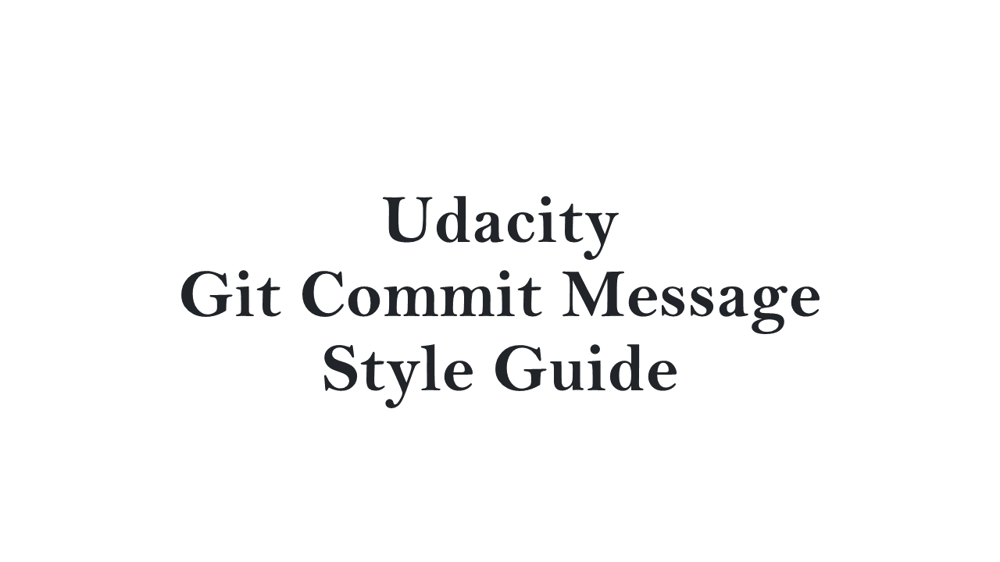

# [Git] Commit Message Convention

커밋 메시지를 일관성 있게 작성하기 위해 정리하며, 유다시티의 커밋 메시지 스타일 가이드를 참조하여 작성한 내용입니다.
[https://udacity.github.io/git-styleguide/](https://udacity.github.io/git-styleguide/)

## 1. 커밋 메세지 구조

```
type: Subject

body

footer
```

커밋메시지는 title, body, footer로 구성하고,
title은 type과 Subject로 이루어 지게끔 한다.

## 2.The Type(title)

- `feat` : 새로운 기능 추가
- `fix` : 버그 수정
- `docs` : 문서 수정
- `style` : 코드 포맷팅, 세미콜론 누락, 기타; 코드 변경이 없는 경우
- `refactor` : 코드 리펙토링
- `test` : 테스트 코드, 리펙토링 테스트 코드 추가; 프로덕션 코드 변경이 없는 경우
- `chore` : 빌드 업무 수정, 패키지 매니저 수정; 프로덕션 코드 변경이 없는 경우

기준을 정하자면,
`feat` : 코드를 새로 올릴 때
`docs` : 문서를 새로 올릴 때
`style` : 올렸던 파일의 이름이나 변수명을 수정할 때
`refactor` : 보다 효율성 좋은 코드를 위해 수정할 때
`fix` : 런타임 에러, 컴파일 에러가 발생해서 수정할 때

## 3. The Subject(title)

- Subject는 50자를 넘지 않아야 하고, 대문자로 시작하며 마침표로 끝나서는 안된다.
- 명령조를 사용하여 커밋이 하는 일을 설명한다.
  - Added (X) -- Add (O)
  - Changes(x), Changed(X) -- Change(O)

## 4. The Body

- 모든 커밋이 본문을 보장할 만큼 복잡하지 않기 때문에 커밋에 약간의 설명이나 내용이 필요할 경우 선택적으로 사용할 수 있다.
- `how`가 아니라 `what`이나 `why`를 설명하도록 한다.
- 제목과 본문 사이의 공백 줄이 필요하고, 각 줄은 72자를 넘지 않도록 한다.

## 5. The Footer

- Footer는 선택사항이며 issue tracker IDs를 참조하는데 사용된다.

## 6. Example Commit Message

```
feat: Summarize changes in around 50 characters or less

More detailed explanatory text, if necessary. Wrap it to about 72
characters or so. In some contexts, the first line is treated as the
subject of the commit and the rest of the text as the body. The
blank line separating the summary from the body is critical (unless
you omit the body entirely); various tools like `log`, `shortlog`
and `rebase` can get confused if you run the two together.

Explain the problem that this commit is solving. Focus on why you
are making this change as opposed to how (the code explains that).
Are there side effects or other unintuitive consequences of this
change? Here's the place to explain them.

Further paragraphs come after blank lines.

 - Bullet points are okay, too

 - Typically a hyphen or asterisk is used for the bullet, preceded
   by a single space, with blank lines in between, but conventions
   vary here

If you use an issue tracker, put references to them at the bottom,
like this:

Resolves: #123
See also: #456, #789
```
