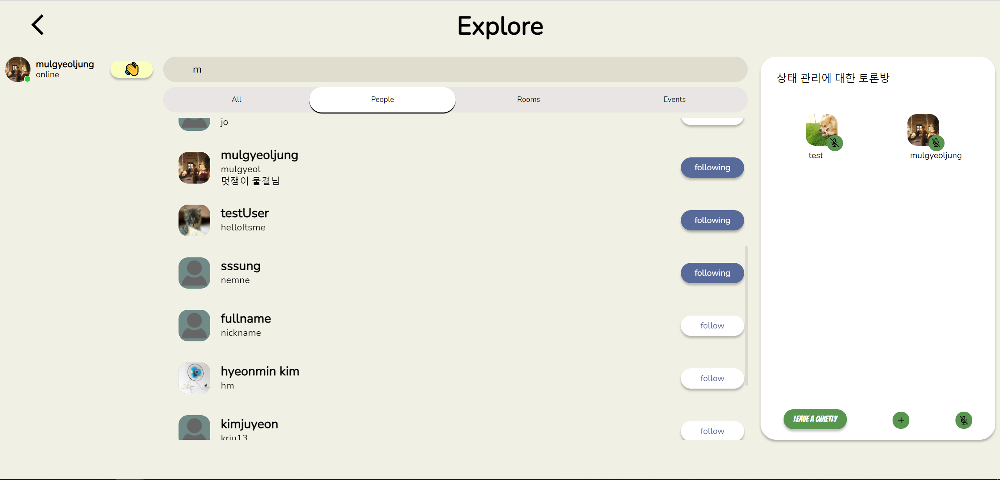
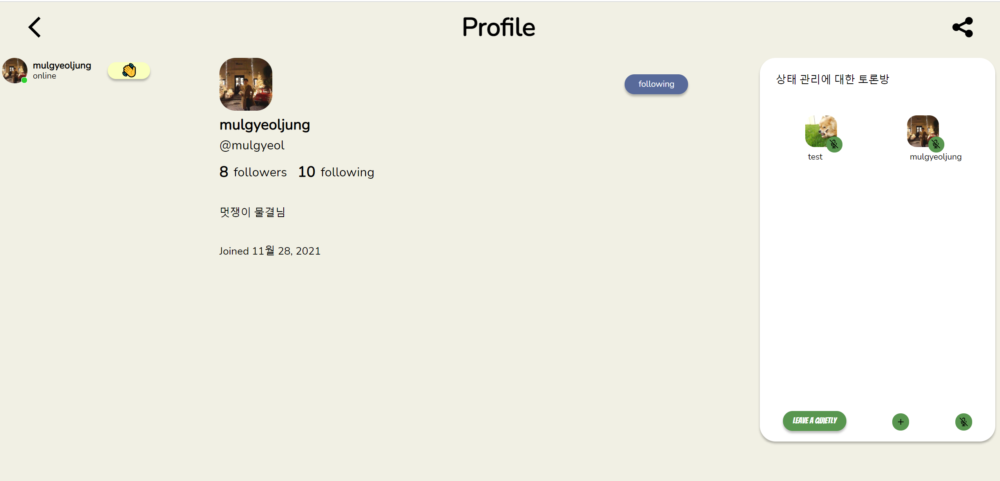
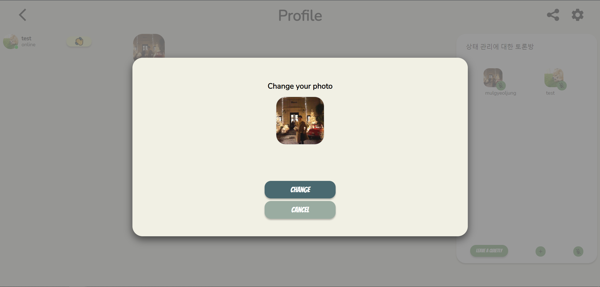
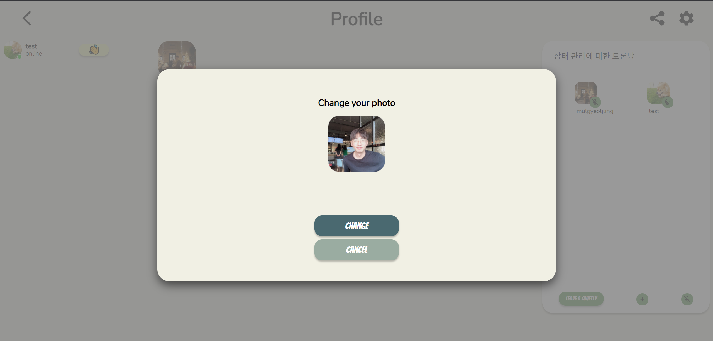
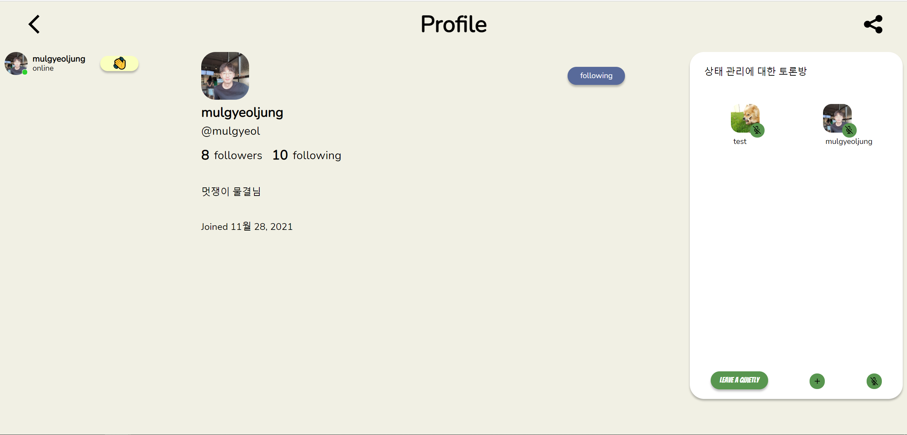
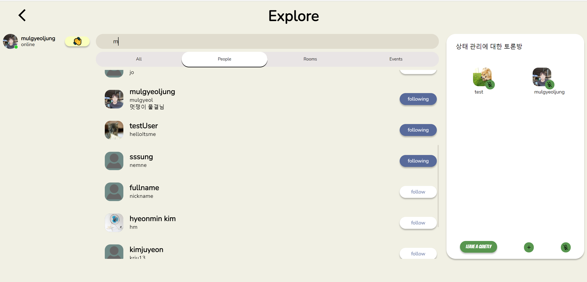
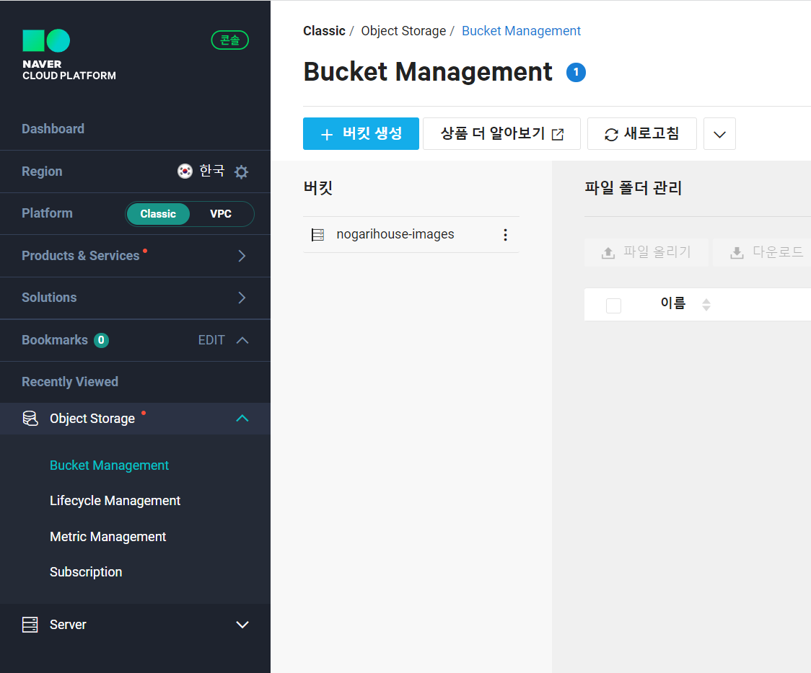
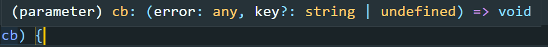

# [프로필 사진 변경] Ncloud ObjectStorage에 이미지 파일 업로드 하기

## 프로필 이미지 변경 서비스 소개

[노가리하우스](https://nogarihouse.nemne-dev) 에서는 사용자가 자신의 프로필 사진을 변경할 수 있는 기능을 제공합니다.

프로필 사진은 음성채팅방, 검색 그리고 자신의 프로필 페이지 등에서 다른 사용자가 자신을 알아볼 수 있게 하거나 자신의 상태를 나타내는 수단이됩니다.





프로필 사진은 본인의 프로필 페이지에서 이미지를 클릭해 변경할 수 있습니다.









## 프로필 사진 변경 흐름 알아보기

1. 사용자가 선택한 이미지는 `<input type="file">`의 files에 저장됩니다.
2. input의 값이 바뀔 경우에 preview 이미지를 갱신 시킵니다.
3. `change` 버튼을 누르면 `multipart/form-data` 형태로 서버에 이미지 파일이 전송됩니다.
4. 서버에서는 `multer`, `multer-s3` 그리고 `aws-sdk` 를 사용해 `Naver Cloud Platform의 ObjectStorage`에 이미지 파일을 저장합니다.
5. 이미지 파일의 무결성을 보장하기 위해 `현재시간`+ `UUID v4` + `기존 이미지 파일의 확장자` 형태로 파일명을 지정해 저장하게 됩니다. 

## 구현 과정 살펴보기

### 1. 이미지 선택하기

input 태그는 감추고, Image를 label로 감싸 클릭시 이미지를 선택할 수 있도록 했습니다.

```tsx
const CustomInput = styled.input`
  display: none;

  & + label {
      width: 200x;
      height: 200px;
      cursor: pointer;
  }
`;

.
.
.

<CustomInput id="c2" type="file" accept="image/gif, image/jpeg, image/png" onChange={inputOnChange} />
<label htmlFor={'c2' as string}>
  <PreviewProfileImage src={previewImageURL} />
 </label>
```

### 2. preview 이미지 갱신하기

previewImageURL에 대한 상태가 변경되고 동시에 서버로 전달될 예비 이미지 파일의 상태 또한 변경됩니다.

```tsx
const inputOnChange = (e : any) => {
  if (e.target.files[0]) {
    const imageFile = e.target.files[0];
    const imageUrl = URL.createObjectURL(imageFile);
    setPreviewImageURL(imageUrl);
    setPotentialProfileImage(imageFile);
  }
};
```

### 3. 서버로 이미지 파일 전송하기

이미지 파일를 User식별 Id와 함께 FormData 형태로 만들어 서버에 전달합니다.

> **`FormData`** 인터페이스는 form 필드와 그 값을 나타내는 일련의 key/value 쌍을 쉽게 생성할 수 있는 방법을 제공합니다. 또한 `XMLHttpRequest.send()` (en-US) 메서드를 사용하여 쉽게 전송할 수 있습니다. 인코딩 타입이 `"multipart/form-data"`로 설정된 경우, form에서 사용하는 것과 동일한 포맷을 사용해야 합니다.
> 

> `formData.append(key, value)` : FormData 객체안에 이미 키가 존재하면 그 키에 새로운 값을 추가하고, 키가 없으면 추가합니다.
> 

fromData의 key값과 value값은 `<input>`태그의 id값과 value값 쌍의 형태와 동일합니다.

```tsx
const changeImageHandler = async () => {
    if (potentialProfileImage) {
      const formData = new FormData();
      formData.append('profileImage', potentialProfileImage);
      formData.append('userDocumentId', user.userDocumentId);

      const response = await changeProfileImage(user.userDocumentId, formData);
			.
			.
			.
  };
```

fetch요청의 body에 formData를 넣어 서버에 전달합니다. 별도로 `'content-type': 'multipart/form-data'` 를 헤더에 추가하지 않아도, `'multipart/form-data'` 형태로 전달됩니다.

response에는 새롭게 저장된 이미지의 URL을 받아옵니다.

```tsx
export const changeProfileImage = async (userDocumentId: string, formData: FormData) => {
  let response = await fetch(
    `${process.env.REACT_APP_API_URL}/api/user/profile-image`,
    {
      method: 'post',
      credentials: 'include',
      body: formData,
    },
  );
  response = await response.json();
 .
 .
 .
};
```

### 4. Naver Cloud Platform에 이미지 저장하기

 **Ncloud ObjectStorage 이용 신청하기**

> 1. 콘솔에 접속하여 **Object Storage** 서비스를 선택합니다.
> 2. Object Storage **이용신청**을 클릭하여 서비스를 신청합니다.
> 3. 콘솔에 접속해서 버킷을 생성합니다.
> 4. 버킷에 필요한 파일을 업로드, 다운로드하여 활용합니다.
> 



[NAVER CLOUD PLATFORM - ObjectStorage](https://www.ncloud.com/product/storage/objectStorage)

위 과정까지 이루어지면 Bucket Management 내에서 직접 파일을 업로드 하고 조회할 수 있습니다.

 **Javascript SDK for S3 API**

> **Q. S3와 연동되는 툴을 사용할 수 있나요?
> A.** Object Storage는 AWS S3 compatible API를 제공하므로, S3를 활용한 툴을 Object Storage에서도 사용할 수 있습니다.
>
>출처 : [object storage 사용가이드](https://guide.ncloud-docs.com/docs/storage-storage-6-1)
> 

사용가이드에서 안내된 것 처럼, AWS S3에서 제공하는 `Javascript SDK`를 이용하여 네이버 클라우드 플랫폼 Object Storage를 사용할 수 있습니다.

SDK를 이용하기 위해서 먼저 NCP에서 인증키를 생성해 `ACCESS KEY`와 `SECRET KEY`를 받아와야합니다.

[](https://www.ncloud.com/mypage/manage/auth)

 **필요한 모듈 설치하기**

```bash
npm install multer multer-s3 aws-sdk
```

- multer : `multer`는 파일 업로드를 위해 사용되는 `multipart/form-data` 를 다루기 위한 node.js 의 미들웨어입니다.
- multer-s3 : `multer-s3`는 s3.upload(`aws-sdk`) 호출과 함께 multer의 스토리지 엔진 설명서의 기존 코드 샘플을 쉽게 이용하도록 통합한 패키지입니다.

 **.env 파일 설정**

서버 측 env 파일에 다음과 같이 설정을 추가합니다.

```bash
AWS_ACCESSKEY=<발급 받은 ACCESS_KEY>
AWS_SECRETKEY=<발급 받은 SERCRET_KEY>
AWS_REGION=kr-standard
S3_ENDPOINT=https://kr.object.ncloudstorage.com
S3_BUCKET=<생성한 BUCKET> # 예시에서는 nogarihouse-images
```

 **이미지 업로드 미들웨어 만들기**

```tsx
// image-upload.ts

import { Request } from 'express';
import multer from 'multer';
import multerS3 from 'multer-s3';
import AWS from 'aws-sdk';
import { v4 } from 'uuid';

const s3 = new AWS.S3({
  endpoint: new AWS.Endpoint(process.env.S3_ENDPOINT as string),
  accessKeyId: process.env.AWS_ACCESSKEY,
  secretAccessKey: process.env.AWS_SECRETKEY,
  region: process.env.AWS_AWS_REGION,
});

const storage = multerS3({
  s3,
  bucket: process.env.S3_BUCKET as string,
  contentType: multerS3.AUTO_CONTENT_TYPE,
  acl: 'public-read',

  key(req:Request, file, cb) {
    const originFilename = file.originalname;
    const extension = originFilename.substring(originFilename.lastIndexOf('.'));
    cb(null, `uploads/profile-images/${new Date().getTime()}-${v4()}${extension}`);
  },
});

export default multer({ storage });
```

- s3 : Object Storage 접근에 대한 설정을 합니다.
- storage : 버킷에 대한 접근과 파일 유형을 설정합니다.
    - contentType : 파일의 내용과 mimeType을 설정하는 데 사용할 수 있습니다. multer-s3가 파일의 콘텐츠 형식을 자동으로 찾도록 하려면 multerS3.AUTO_CONT_TYPE(상수) 를 사용합니다.
    - ACL(Access Control List) : 파일에 대한 접근을 컨트롤 합니다.
    - key : 파일의 이름을 지정합니다.
        - cb : 이름을 지정할 때 사용될 callback 함수 입니다.
        - 무결성 보장을 위해 현재시간, UUID, 기존파일의 확장자를 이용해 파일명을 지정합니다.
        
        
        
    

 **API Router에 연결하기**

```tsx
import imageUpload from '@middlewares/image-upload';
.
.

userRouter.post('/profile-image', imageUpload.single('profileImage'), async (req: Request, res: Response) => {
    const { userDocumentId } = req.body;
    const { location } = req.file;
    try {
      const result = await usersService.updateUserProfileUrl(userDocumentId, location);
      res.json({ ok: result, newProfileUrl: location });
    } catch (e) {
      res.json({ ok: false });
    }
  });
```

작성한 이미지 업로드 모듈을 api router의 미들웨어로 넣어줍니다.

미들웨어를 거쳐 나온 req에서 필요한 정보들은 다음과 같습니다.

- userDocumentID : client측에서 formData에 user 식별자로 넣어준 string 타입은 req.body에 담겨 있습니다.
- location : req.file의 location key값에는 미들웨어를 거쳐서 object스토리지에 새롭게 저장된 이미지의 URL이 담겨있습니다.

위 정보를 이용해 DB에 저장된 user의 프로필 이미지 URL을 갱신하고, client측에 새 url을 전달해 상태를 갱신합니다.

### 참고 자료

---

[FormData - Web API | MDN](https://developer.mozilla.org/ko/docs/Web/API/FormData)

[Object Storage 개요 - Object Storage 사용 가이드](https://guide.ncloud-docs.com/docs/storage-storage-6-1)

[multer/README-ko.md at master · expressjs/multer](https://github.com/expressjs/multer/blob/master/doc/README-ko.md)

[multer-s3](https://www.npmjs.com/package/multer-s3)