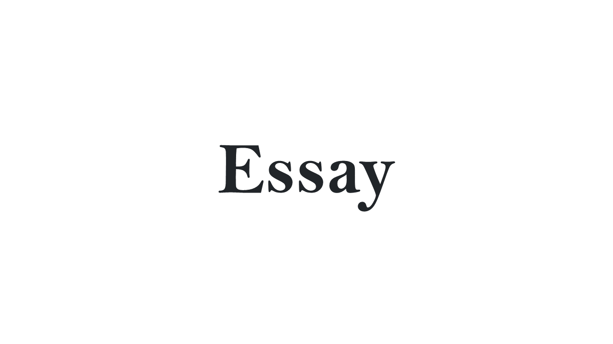

## 들어가며

Final Project를 마지막으로 SSAFY 1학기가 마무리 됐습니다. Java의 기본 문법부터 Spring Boot와 Vue 프레임워크를 사용한 프로젝트까지 시간가는 줄 모르게 배우고 경험했습니다. 이미 익숙한 내용들을 배우기도 했지만, 다뤄본 적이 없어 정리와 연습이 필요한 내용들을 배우기도 했습니다. 이번 프로젝트에서는 익혔던 모든 내용을 적용해보고 다룰 수 있었습니다. 이번 포스팅은 프로젝트를 진행하며 고려한 내용과 느낀점을 정리해보려고 합니다.

## Front-End를 경험하다

이전까지 프론트엔드는 '클라이언트에게 보여지는 View를 담당한다'고만 생각했습니다. HTML, CSS를 이용해 화면을 구성하고, Javascript를 이용해 '동적인 부분'을 처리한다고 알고는 있었지만, 이 '동적인 부분'의 개념이 잘 정리되지 않았습니다. '생활코딩'의 Javascipt 강의의 첫 내용은 웹페이지의 배경색을 바꾸는 버튼을 보여줍니다. 이 예시처럼 클릭하면 발생하는 이벤트를 처리하는 기능을 구현하면서 Javascript가 담당하는 '동적인 부분'은 이런 것 뿐이구나 하고 그동안 오해를 해왔습니다.

또한, 백엔드를 공부한다고 하면 반드시 거치는 개념 중 하나가 REST방식의 API입니다. 이전에 REST API에 대해 정리하고 구현하면서도 왜 REST방식을 사용하는지 제대로 와닿지는 못했는데, 결국 프로젝트를 처음부터 끝까지 구현하는 도중에서야 정리가 되었습니다.

서버는 클라이언트의 요청을 받아내고, 데이터베이스에 방문해 이를 적절한 형태로 가공하여 응답을 해주어야 합니다. 이 응답에 담겨있는 데이터를 어떤 식으로든 사용자에게 알려주어야 하죠. 바로 이 데이터를 적절한 형태로 사용자에게 전달하는 것이 '동적인 부분'의 중요한 파트라는 것을 깨달았습니다. 머리로는 대충 '그렇구나' 싶었었지만, 이번 프로젝트를 하면서 제대로 제대로 느꼈다고 표현하는 것이 좋을 것 같네요.

이번에 맡은 작업은 기존에 JSP로 작성한 부분을 Vue.js 기반 프로젝트로 바꾸면서 Spring Boot로 구현된 서버와 연동하는 것이었습니다. 그러면 그동안 JSP에서 데이터를 받아 처리한 부분은 이번에 느꼈다던 '동적인 부분'이 아니었나? 라고 물어보시면 그것도 맞는 이야기입니다. 하지만 Spring의 Controller에서 직접 View Resolver를 통해 이동할 jsp파일을 넘겨주는 패턴을 구현하는 동안에는 '프론트와 백엔드의 완전한 분리'에 대해서 생각해보지 못했습니다. 또, REST API로 서버를 구현한다면, 웹 뿐만 아니라 데이터를 보여줘야하는 다른 플랫폼에서도 사용할 수 있겠다고 느꼈습니다.

그동안 알고있었다고 생각했는데, 구현하면서 느끼는 정도는 또 다른 차원이네요.

그래서 웹 개발 프로세스에서 개발자 각각의 역할을 짧게나마 한 번 정리하자면, (물론 팀마다 다르겠지만) 웹 디자이너분의 작업 결과물인 PSD 파일을 넘겨받아 HTML, CSS를 그리는 역할을 맡는 '퍼블리셔'라는 직업이 존재하고, `백엔드 개발자`가 서버를 만든다면, `프론트엔드 개발자`는 자바스크립트를 담당합니다.

## 프로젝트를 진행하며 애먹었던 부분

### 1. Vue의 동작 순서 제어하기

이번 프로젝트에서 가장 까다로웠던 부분 중 하나는 Vue의 라이프 사이클을 이해하고 응답받은 데이터를 처리하는 부분이었습니다. Vuex를 적용하고, axios로 받은 데이터를 가지고 사용자에게 뿌려줄 때, Vue의 동작 순서를 제대로 이해할 필요가 있었습니다. Kakao Map API는 왜 mouted에서 script를 작성해 주어야 했는지, computed에서 getMapper로 store와 연결한 데이터들이 왜 화면에 보여지지 않는지, 표를 그리려고 작성한 태그에서 호출한 함수가 create에서 연결해준 함수보다 왜 먼저 호출 되는지 등등.. 프로젝트 진행 중 마주한 문제들은 동작 순서를 온전히 이해하기 전까지는 해결하기가 어려웠습니다.

### 2. 로그인 처리와 JWT 토큰

서버의 유저데이터를 기반으로 로그인 기능을 구현 하기 위해 JWT 토큰의 개념을 이해하고 구현하는 과정이 필요했습니다. 백엔드 개발을 담당한 분과 함께 구현해보려고 했으나, 어려움을 느꼈고, 시간이 부족한 상황이라 일단 localStorage를 이용해 구현했습니다. 이 내용은 JWT 토큰과 로그인 처리에 대해 나중에 꼭 정리하고자 기록으로 남깁니다.

## 마무리하며

점점 공부한 내용들이 많아지면서 '공부한 내용들을 잘 알고있는게 맞을까?'라는 의구심이 들었습니다. 그게 이어져 지금 새롭게 해보고자 하는 것들을 멈춰놓고 배웠던 내용을 돌아보는 시간을 가져야하나 싶기도 했습니다. 이번 프로젝트는 이런 생각들이 '생각'으로 남아있어서 계속 맴돌았던 것이라고 느끼게 해줬습니다. 배우고, 적용해보고 필요하면 다시 찾아보고, 그래서 결국 완성하는 과정 속에서 걱정했던 부분은 해결될 것이고 성장 또한 이룰 수 있지 않을까 싶습니다.
