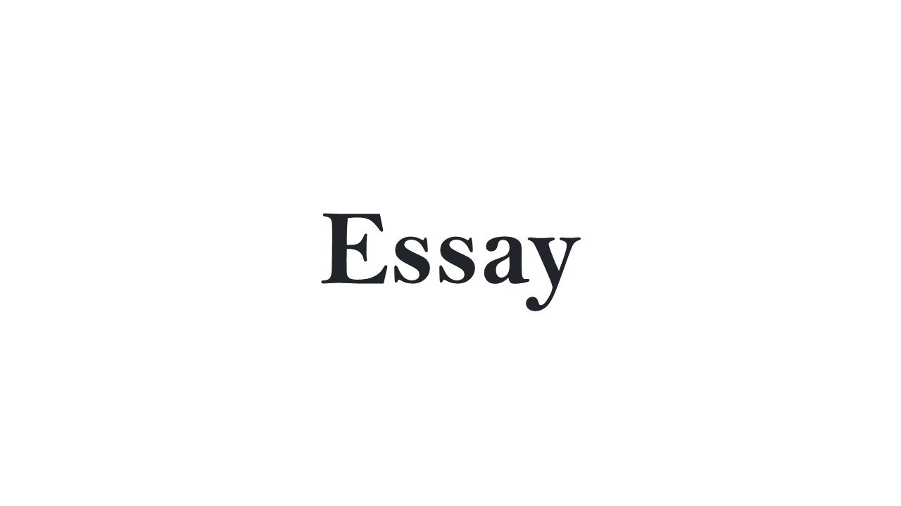
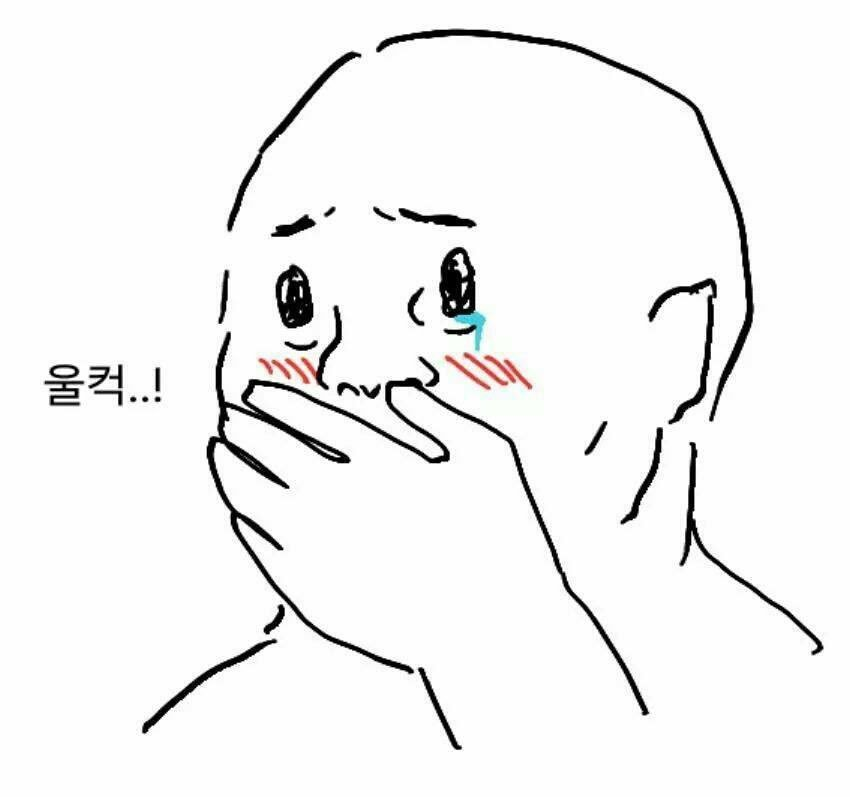
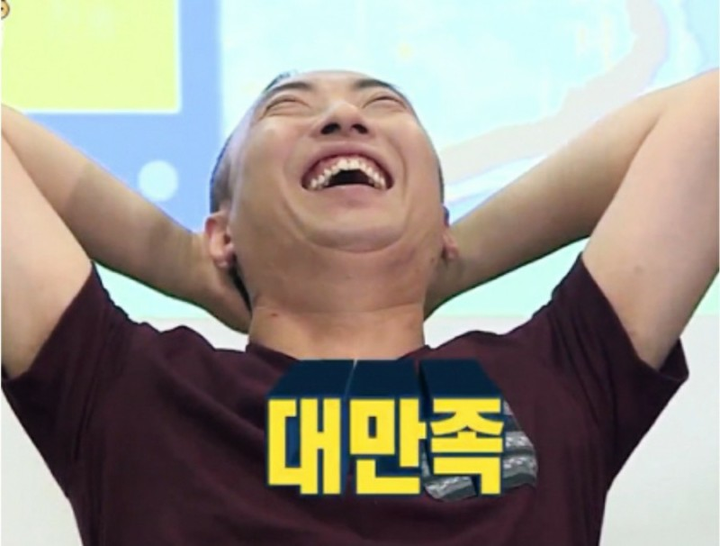
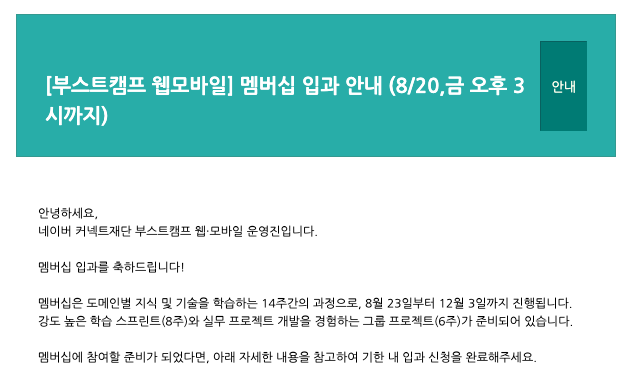

## 들어가며

SSAFY 1학기 회고가 블로그의 마지막 포스팅이었는데, 갑자기 `부스트캠프 챌린지`라니요? 사실, 1학기를 마치고 2학기 첫 프로젝트를 시작할 즈음 네이버 부스트캠프에 합격해서 SSAFY를 나오게 되었습니다. 이 회고는 SSAFY와 부스트캠프를 비교하고자 하는 글은 아니며, 개인적인 경험을 다룰 예정입니다.

## SSAFY는 왜 나왔나요?
### 무난했던 1학기
개인적으로 아주 좋은 경험을 했던 SSAFY였습니다. Java의 문법부터 알고리즘 문제 해결, 천천히 웹 개발 전반에 관해 배우며 실력을 키워나갈 수 있었습니다. 성적우수상도 받고 프로젝트도 팀원들과 열심히 진행했었죠. `그런데 왜?` 라고 물으신다면 한 번의 입사 지원이 큰 결심을 하게 해주었습니다. 

다른 교육생분들은 1학기 동안에도 열심히 입사 지원을 하셨고, 취업하게 되어 나가신 분들도 많으시지만 저는 한 번도 입사 지원을 하지 않았습니다. 제가 희망하는 곳은 `자체 서비스`를 하는 `개발 문화가 잘 갖춰진` 회사였습니다. 이런 곳에 입사하기 위한 준비가 아직 덜 되었다고 생각했던 건지, 아무튼 많은 우대채용 공지가 있었지만 지원하지 않았습니다.

### 첫 면접과 피드백
그렇게 1학기를 보내고, 이후 잡페어 기간에 눈에 띄는 곳이 있었습니다. 규모는 크지 않지만 제가 잘 사용중인 서비스를 제공하는 회사였고, 저의 가치관과 비슷한 마인드를 가지고 있는 회사 소개를 보고 지원하고 싶었습니다. FE파트로 지원해 서류, 1차 면접을 통과하면서 최종 기술면접까지 보게 되었고, 2시간 가량의 면접을 경험하면서 제가 부족한 부분이 많다는 것을 알게 되었습니다.

면접을 마무리하면서 피드백을 요청드렸는데, 너무도 친절하고 자세히 부족한 부분과 보완할 점을 알려주셨습니다. 게다가 보완에 필요한 책도 보내주셨습니다.

간략히 정리하자면 바닐라 자바스크립트 자체에 대한 이해가 부족했고, 서버와 클라이언트 통신에서 HTTPS, Authentication 같은 꼭 필요한 깊은 부분에 대한 이해가 부족했습니다.

피드백에서 해당 내용에 대해 깊게 이해해 볼 생각을 못했던 것을 꿰뚫어 보신것 같아 부끄럽기도 했지만, 앞으로 어떤 부분을 더 학습하면 좋을 지 가이드가 주어졌다고 생각했습니다. 그동안 배운 내용을 그대로 적용해서 프로젝트를 완성하는 것에만 집중했구나 느끼기도 했네요.

아무튼 제가 부족한 점들이 비단 이 기업이 요구하는 사항일 뿐만 아니라, 프론트엔드 개발자라면 필히 알고있어야 할 내용들이기 때문에 꼭 보완하고 제대로 이해하고 싶었습니다.

## 어떻게 보완할 것인가?

SSAFY에서 프로젝트를 진행하며 부족한 부분을 보완할 수도 있었지만, 주어진 주제로 프로젝트를 하는 것보다 주도적으로 학습하며 보완하고 싶었습니다. 그러던 중 SSAFY와는 조금 다른 분위기인 네이버 `boostcamp`에 합격하게 되었고, JavaScript로 웹 풀스택을 경험하는 이 과정에서 `제가 원하는 부분을 더 채울 수 있지 않을까?` 라는 생각이 들었습니다.

## 부스트 캠프 챌린지
### 짧은 후기
정말로 힘든 과정이었습니다. `첫 주는 그래도 할만 했다.`라는 포스팅을 봤던 기억이 있는데, 저는 그렇지 않았습니다. 정해진 시간내에 해결을 해서 제출한 적은 손에 꼽을 정도이고 매일 늦게까지 학습했습니다. 미션의 처음부터 끝까지 세세하게 다루고 싶을 정도로 열심히 했고, 학습한 내용도 꾸준히 잘 정리했습니다. 완벽하게 구현해서 제출하지 못한 날도 있었지만, 그 날 알아야할 부분은 꼭 알고 넘어가려고 노력했습니다. 

### 그래서 어떤 걸 배웠나요?
미션 자체에서 요구하는 것도 매우 중요한 내용이었지만, 학습하는 방법, 생각하는 방법 그리고 코드에 대해 많이 생각할 수 있었습니다.

#### 1. 모르는 것들을 학습하고 정리하는 습관
미션을 이해하는데만도 한참 걸렸던 적이 많습니다. 아는 내용이라 쉬울 것 같았지만 내가 정확히 그리고 자세히 알고있는지 확인하는 과정이 필요한 날도 있었고, 주제가 전혀 모르는 내용이라 선행학습이 필요한 경우도 있었습니다. 그럴 때마다 자료를 찾아서 학습학고, 다른 사람들과 도움될 만한 내용들에 대해 이야기 나눠보는 과정이 정말 도움이 많이 되었습니다. 대충 그렇구나.. 하고 적용만 해보는 것이 아니라, 정확하고 자세한 이해를 바탕으로 구현해보는 것 그리고 이해한 내용을 나만의 언어로 정리하는 것은 앞으로도 계속 지녀야할 습관이라고 생각합니다.

#### 2. 최대한 깔끔한 코드를 작성하는 습관
우선 동작이 되는 게 우선이라고 생각해왔던 그동안과는 다르게, 작성하기 이전부터 깊게 고민하고 설계하려고 노력하게 되었습니다. 또, 피어분들과 `효율성과 가독성 중 어떤 것이 더 중요한가?`라는 주제로 이야기를 나누기도 했고, 마스터분이 같은 주제로 답변해 주신 내용은 `일단은 가독성이 중요하다` 였습니다. 코드리뷰를 고려한 것도 있었지만, 여러 사람이 협업하는 과정에서는 분명 `이해하기 쉬운 코드`가 좋은 코드일 것입니다. 미션 구현이 조급한 날엔 복잡하게 코드를 작성하고 주석을 왕창 달아 설명을 했는데.. 오히려 시간이 더 드는 느낌도 있었습니다. 반면에, 짧고 가독성 좋게 구현을 하면 깊은 이해를 바탕으로 동료분들과 이야기할 것들이 많아졌습니다. 

#### 3. 내가 작성한 코드를 돌아보는 습관
그동안 내가 작성한 코드가 문제없이 돌아갈 때, 되돌아 본 적이 있었나? 하고 되물어보면 부스트캠프 이전까지는 없었습니다. 지금 생각해보면 많이 부끄럽네요. 더 효율적으로 작성할 수는 없었는지 고민하고, 중복되는 부분은 재사용성을 높여 깔끔하게 다시 구현해보는 과정에서 특히 더 많이 성장했습니다. 

## 그래서 만족하나요?
결론부터 말씀드리면, 

`네, 만족합니다.`

우선 JavaScript에 대한 이해도가 높아졌습니다. 아직도 헷갈리는 개념들이 있지만, 이 언어를 다루는데 많이 익숙해졌습니다. 또, 보완하고 싶었던 내용들도 미션들을 통해서 많이 생각해볼 수 있었습니다. 

아직 SSAFY에서 줬던 교육지원금...이 생각나기는 하지만 제가 원하는 방향으로 더 성장할 수 있었다고 생각합니다.

조금 투정을 부리자면, 다른 피어분이 `매일 앞으로의 수명을 끌어다 사용하고 있다`고 하셨는데 매우 공감 되었습니다. 잠도 많이 줄이면서 학습해서인지, 마지막 주차에는 너무 무리해서인지 팔이 붓고, 컨디션이 매우 안좋았습니다. 적당한 스트레칭과 건강관리에 대한 중요성도 깨닫게 해주는 부스트캠프 챌린지.. 과정이었네요.

## 멤버십
이렇게 열정적으로 한달을 보낸적이 있나 싶을 만큼 열심히했고, 어떻게 학습하면 좋을 지, 어떤 걸 해보면 좋을 지에 대해 많은 생각을 해볼 수 있었던 것으로도 매우 만족스러웠습니다. 

초반에는 멤버십 합격을 많이 염두해뒀지만, 어느 순간 그게 중요한 게 아니라는 걸 대부분의 피어분들도 느끼게 되셨을 겁니다. 그래도 불합격이면 아쉬웠을 테지만

조금 더 같이 동료분들과 같이 할 수 있는 기회가 주어졌습니다! 물론, 너무 주어진 것들에만 의존하지 않고 스스로 해보고 싶은 것들을 해나가는 것도 잊지 않으려고 합니다.

## 마치며
특히 건강 관리를 잘하면서, 멤버십에서도 많은 것을 배우고 경험할 수 있으면 좋겠습니다.
더 나은 개발자가 되길 희망하며 마칩니다.