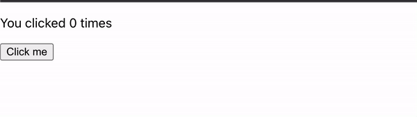

# vanillaJS 상태관리(1) - useState를 구현해보자.

## 글을 작성하는 이유

- useState는 어떻게 동작하고, 변경이 일어날 시 컴포넌트를 어떻게 렌더링 하는지 알아본다.
- useState를 직접구현해보고, vanilaJS로 SPA를 구현할 때 활용할 수 있는 방안을 고민해 본다.

### UseState란?

리액트 컴포넌트에서 사용하는 상태관리 hook 중 하나이다. 컴포넌트는 상태에 의존하고, 상태에 변경이 일어나면 해당 컴포넌트는 다시 렌더링 된다.

### UseState의 사용

리액트 컴포넌트 내에서, useState를 사용하는 방식은 다음과 같다.

```jsx
import React, { useState } from 'react';

function Example() {
  const [count, setCount] = useState(0);
	.
	.
	.
}
```

react module에서 useState를 import하고, 컴포넌트 내부 상단에서 초기감을 파라미터로 넘겨주며, 변수를 사용할 상수과 재지정 함수를 분해할당 받는다. 

사용자의 동작에 의해 setCount로 count값을 변경하게 되면, 컴포넌트가 렌더링되며 새로운 값으로 결과를 보여줄 수 있다.

```jsx
import React, { useState } from 'react';

function App() {
  const [count, setCount] = useState(0);
  return (
    <div>
      <p>You clicked {count} times</p>
      <button onClick={() => setCount(count + 1)}>
        Click me
      </button>
    </div>
  );
}

export default App;
```


반면, 직접 count 값을 변경하고자하면, 적용되지 않는다. ⇒ 더 정확히 말하자면, 리렌더링이 이루어지지 않는다.

```jsx
import React, { useState } from 'react';

function App() {
  let [count, setCount] = useState(0);
  return (
    <div>
      <p>You clicked {count} times</p>
      <button onClick={() => count = count + 1}>
        Click me
      </button>
    </div>
  );
}

export default App;
```



여기서 정리해 보자면, useState는 다음과 같은 특징이 있다.

1. 상태는 초기화 이후 setState를 통해서만 변경이 가능하도록 한다.
2. setState에 의해 값이 변경되면 해당 컴포넌트는 자동으로 리렌더링 된다. 

### 일단 useState와 비슷하게 구현해보자.

먼저, 작성한 파일들은 다음과 같다.

```html
<!--index.html-->

<!DOCTYPE html>
<html lang="en">
<head>
    <meta charset="UTF-8">
    <meta http-equiv="X-UA-Compatible" content="IE=edge">
    <meta name="viewport" content="width=device-width, initial-scale=1.0">
    <title>useState test</title>
</head>
<body>
    <div id="app"></div>
    <script type="module" src="./index.js"></script>
</body>
</html>
```

```jsx
//index.js

import click from "./components/Click.js";

const app = document.getElementById("app");
click(app);
```

```jsx
//component/click.js

import useState from '../hooks/custom-uses-tate.js';

export default function Click($target) {
  const [count, setCount] = useState(0);

  const render = () => {
    $target.innerHTML = /*html*/`<div>
                                <p>You clicked ${count} times</p>
                                <button id="increase-button">
                                    increase
                                </button>
                            </div>
                        `;

    setEvent();
  }

  const increaseCount = () => {
    setCount(count + 1);
  }

  const setEvent = () => {
    const $increase = document.getElementById("increase-button");
    $increase.addEventListener("click", increaseCount);
  }

  render();
}
```

App 모듈에서 Click이라는 함수형 컴포넌트를 호출해 렌더링한다. Click 컴포넌트 내부에서는 count라는 상태를 useState로 다룬다.

Click 함수가 제대로 동작하게 하는 것이 이번 포스팅의 목표이다.

그러면 useState를 작성해보자. 필요로 하는 요구사항은 다음과 같다.

1. 초기 값을 설정한다.
2. setState로 값을 변경할 수 있다.
3. setState가 동작하면, Click 컴포넌트가 렌더링 된다.

가장 까다롭다고 생각되는 부분은 3번이다. useState가 Click 컴포넌트를 실행해야하고, Click 컴포넌트가 받은 $target 또한 알고있어야 한다. React의 useState형태를 그대로 사용하고자 한다면 React 컴포넌트를 비슷한 방식으로 구현해야 할 것 같아 나만의 방식으로 변형해보고자 한다.

useState를 사용해 state와 setState를 할당할 때, 파라미터로 현재 컴포넌트와 타겟을 넘겨줄 것이다.

수정해보면 해당 부분의 코드는 아래와 같다.

```jsx
const [count, setCount] = useState(0, Click, $target);
```

useState가 현재의 컴포넌트와 타겟을 알 수 있도록 설정했다.

이제 본격적으로 useState를 구현해보자

```jsx
// hooks/custom-uses-tate.js

export default function useState(initState, component, $target) {
  let state = initState;

  const setState = (newState) => {
    state = newState;
    component($target);
  }

  return [state, setState];
}
```

state 변수에 초기 값을 할당하고, setState를 통해 값을 변경하면서 componet함수를 실행시켰다. 과연 제대로 동작할까?


렌더링 되는 것은 확인할 수 있지만, 증가된 값이 화면에 보이지 않는다. 어떤 문제가 있을까?

setState에 의해 component가 실행되면, 내부에서 useState가 다시 동작한다. 따라서 state는 다시 초기값 0으로 할당되어 증가되지 않는 것이다.

즉, component의 실행에 의해 useState가 다시 동작할 때, 초기값으로 재할당되지 않도록 해야한다. 

이 문제를 `closure`를 이용해 해결해보자.

```jsx
// hooks/custom-uses-tate.js

let _state;

export default function useState(initState, component, $target) {
  const state = _state || initState;

  const setState = (newState) => {
    _state = newState;
    component($target);
  }

  return [state, setState];
}
```

함수 선언시의 스코프를 기억하는 자바스크립트의 특징을 이용해 구현한 내용이다. 초기 선언시 _state는 값이 할당되지 않았으므로, state에는 initState가 할당된다. 이후 setState를 통해 변경이 일어나면, _state에 새로운 값을 할당한다. 이후 component의 실행에 의해 useState를 다시 호출하면, _state에는 값이 할당되어 있기 때문에 state에는 _state의 값이 할당되고, component는 이 값을 받는다.

이제는 제대로 동작할까?


성공이다. 하지만, 치명적인 문제가 있다. 한 컴포넌트 내에서 여러개의 상태를 관리할 때는 어떨까?

```jsx
//component/click.js

import useState from '../hooks/custom-uses-tate.js';

export default function Click(target) {
    const [count, setCount] = useState(0, Click, target);
    const [backgroundColor, setBackgroundColor] = useState("skyblue", Click, target);

    const render = () => {
        target.innerHTML = /*html*/`<div id="board">
                                  <p>You clicked ${count} times</p>
                                  <button id="increase-button">
                                      increase
                                  </button>
                                  <button id="chagne-background-button">
                                    change background color
                                  </button>
                                  <p>현재 배경색은 ${backgroundColor}입니다.</p>
                              </div>
                          `;

        document.getElementById("board").style.backgroundColor = backgroundColor;
        setEvent();
    }

    const increaseCount = () => {
        setCount(count + 1);
    }

    const changeBackgroundColor = () => {
        if (backgroundColor === "skyblue") setBackgroundColor("pink");
        else if (backgroundColor === "pink") setBackgroundColor("skyblue");
    }

    const setEvent = () => {
        const $increase = document.getElementById("increase-button");
        const $changeBackground = document.getElementById("chagne-background-button");
        $increase.addEventListener("click", increaseCount);
        $changeBackground.addEventListener("click", changeBackgroundColor);
    }

    render();
}
```

위와 같이 두 가지의 상태를 관리하는 컴포넌트로 확장해보자.

실행결과는 다음과 같다.


처음 배경색을 변경하는 버튼을 눌렀을 때는 잘 작동하는가 싶더니, increase 버튼을 누르면 사고가 발생한다. 어떤 일이 발생했는지는 상상이 가능할 것이다.

첫 번째 상태와 두 번째 상태를 따로 관리해줘야한다.

이는 배열과 인덱스를 통해 해결할 수 있다.

```jsx
// hooks/custom-uses-tate.js

let _state = [];
let _index = 0;

export default function useState(initState, component, $target) {
	const index = _index++;
  const state = _state[index] || initState;

  const setState = (newState) => {
    _state[index] = newState;
		_index = 0;
    component($target);
  }

  return [state, setState];
}
```

_state의 선언과 마찬가지로 외부 스코프에 _index값을 0으로 할당한다.

useState가 실행될 때마다 내부 index값에 _index값을 추가하고, _index는 1을 증가시킨다.

첫 렌더링시 state에는 _state[index]에 값이 할당되어있지 않으니 initState 값이 들어간다.

setState에 의해 값 변경이 이루어 지면, _state[index]에 값이 할당되고, 재렌더링시 state에는 _state[index]의 값이 할당된다.

setState의 동작시 _index를 0으로 초기화 시켜주는 이유는 컴포넌트 재 렌더링시 useState의 선언 순서에 따라 의도한 상태를 _state에서 얻기 위해서이다.

결과를 확인해보자.


만족스럽게 동작하는 것을 확인할 수 있다.

### 한 단계 더 나아가기

지금까지도 useState의 동작방식을 이해하는데 충분하지만, React 컴포넌트가 아닌 간단한 함수형 컴포넌트에서 지금의 구현은 제대로 활용되지 못할 것이다.

생각해보자. 다른 컴포넌트에서 이 useState를 활용할 수 있을까? setState를 통해 특정 컴포넌트(들)가(이) 렌더링 된다면 원하는 상태를 index를 통해 찾을 수 있을까?

이것을 Map을 통해 해결해보고자 한다.

object와 달리 Map은 key값의 자료형에 제한이 없다.

따라서 _index와 _state를 Map에 component를 키로 주어 관리할 생각이다.

아이디어는 이렇다. 현재 관리되고 있는 형태 그대로, component 별로 관리하는 것이다.

```jsx
// hooks/custom-uses-tate.js

const indexOfComponents = new Map();
const statesOfComponents = new Map();

export default function useState(initState, component, $target) {
  if (!indexOfComponents.get(component)) {
    indexOfComponents.set(component, 0);
  }

  if (!statesOfComponents.get(component)) {
    statesOfComponents.set(component, []);
  }

  const index = indexOfComponents.get(component);
  const states = statesOfComponents.get(component);

  indexOfComponents.set(component, index + 1);

  const state = states[index] || initState;

  const setState = (newState) => {
    states[index] = newState;
    indexOfComponents.set(component, 0);
    component($target);
  }

  return [state, setState];
}
```

### 구현한 useState를 적용해보자.

또 다른 Bark라는 컴포넌트를 추가해서 각각 상태관리를 하도록 작성해보자. 코드는 아래와 같다.

```html
<!--index.html-->

<!DOCTYPE html>
<html lang="en">
<head>
    <meta charset="UTF-8">
    <meta http-equiv="X-UA-Compatible" content="IE=edge">
    <meta name="viewport" content="width=device-width, initial-scale=1.0">
    <title>useState test</title>
</head>
<body>
    <div id="app"></div>
    <script type="module" src="./index.js"></script>
</body>
</html>
```

```jsx
//index.js

import Click from "./components/Click.js";
import Bark from './components/Bark.js';

const app = document.getElementById("app");

app.innerHTML = `
  <div id="click"></div>
  <div id="bark"></div>
`;

const click = document.getElementById("click");
const bark = document.getElementById("bark");

Click(click);
Bark(bark);
```

```jsx
//component/Click.js

import useState from '../hooks/custom-uses-tate.js';

export default function Click(target) {
  const [count, setCount] = useState(0, Click, target);
  const [backgroundColor, setBackgroundColor] = useState("skyblue", Click, target);

  const render = () => {
    target.innerHTML = /*html*/`<div id="board">
                                <p>You clicked ${count} times</p>
                                <button id="increase-button">
                                    increase
                                </button>
                                <button id="chagne-background-button">
                                  change background color
                                </button>
                                <p>현재 배경색은 ${backgroundColor}입니다.</p>
                            </div>
                        `;

    document.getElementById("board").style.backgroundColor = backgroundColor;
    setEvent();
  }

  const increaseCount = () => {
    setCount(count + 1);
  }

  const changeBackgroundColor = () => {
    if (backgroundColor === "skyblue") setBackgroundColor("pink");
    else if (backgroundColor === "pink") setBackgroundColor("skyblue");
  }

  const setEvent = () => {
    const $increase = document.getElementById("increase-button");
    const $changeBackground = document.getElementById("chagne-background-button");
    $increase.addEventListener("click", increaseCount);
    $changeBackground.addEventListener("click", changeBackgroundColor);
  }

  render();
}
```

```jsx
//component/Bark.js

import useState from '../hooks/custom-uses-tate.js';

export default function Bark(target) {
  const [count, setCount] = useState(0, Bark, target);

  const render = () => {
    target.innerHTML = /*html*/`
    <button id="increase-bark-count">누르면 개가 짖어요.</button>
    <div>
      <p>
      ${'왈!! '.repeat(count)}
      </p>
    </div>
    `;

    setEvent();
  }

  const increaseCount = () => {
    setCount(count + 1);
  }

  const setEvent = () => {
    const $increase = document.getElementById("increase-bark-count");
    $increase.addEventListener("click", increaseCount);
  }

  render();
}
```

```jsx
// hooks/custom-uses-tate.js

const indexOfComponents = new Map();
const statesOfComponents = new Map();

export default function useState(initState, component, $target) {
  if (!indexOfComponents.get(component)) {
    indexOfComponents.set(component, 0);
  }

  if (!statesOfComponents.get(component)) {
    statesOfComponents.set(component, []);
  }

  const index = indexOfComponents.get(component);
  const states = statesOfComponents.get(component);

  indexOfComponents.set(component, index + 1);

  const state = states[index] || initState;

  const setState = (newState) => {
    states[index] = newState;
    indexOfComponents.set(component, 0);
    component($target);
  }

  return [state, setState];
}
```


잘 작동하는 것을 확인할 수 있다.
